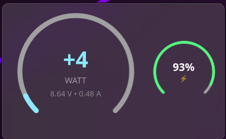

# Energy Info

**Energy Info** is a lightweight KDE Plasma 6 widget that monitors your system's power consumption in real-time. It provides a beautiful and customizable interface to track battery status, voltage, current, and wattage.

 

## 🚀 Installation

1. Download the [last release](https://github.com/postadelmaga/plasmoid-power/releases/latest/download/energy-info.plasmoid)
2. Install using kpackagetool6:
   ```bash
   kpackagetool6 -t Plasma/Applet -i energy-info.plasmoid
   ```
3. Add the widget to your panel or desktop.

## ✨ Features

- **⚡ Real-time Monitoring**: Track wattage, voltage, and current with high precision.
- **🔋 Battery Insights**: View battery capacity, status, and estimated time remaining.
- **📊 Multiple Views**:
  - **Dashboard**: A comprehensive gauge and graph view.
  - **Analytics**: Detailed historical data.
  - **Minimal**: Compact grid for essential information.
- **🎨 Dynamic Coloring**: The widget changes color based on power consumption and charging state.
- **📱 Responsive Design**: Fits perfectly in both horizontal and vertical panels.

## 🛠 Configuration

Right-click the widget and select "Configure Energy Info..." to change the visualization mode and other settings.

---

**Developed with 🤖 Antigravity by Gemini.**
This project was implemented using agentic AI technology to ensure high-quality code and modern design standards.
